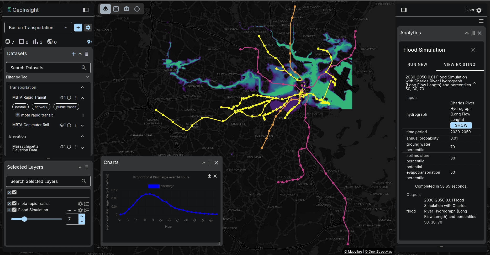

# GeoInsight

[![License][apache-license-image]][license-link]

> Developed by [Kitware Inc.][kitware-link] in collaboration with the [Sustainability and Data Sciences Lab at Northeastern University][sds-lab-link]

> Sample use case examines the effect of coastal flooding on the availability of the Boston Transit system (MBTA). Sample data obtained from [MassMapper][mass-mapper-link], a public tool for open infrastructure data hosted by the state of Massachusetts.

## Cities are Vulnerable to Increasing Natural and Anthropogenic Extremes

Urban areas, particularly those with underserved populations and critical assets in vulnerable zones, are at increased risks of cascading failures of lifeline services due to climate change, urbanization, and aging-infrastructure failure. With 80 percent of Americans living in urban areas, there is an urgent need for analytic models that can effectively address and visualize these growing threats and potentially avoid substantial loss of life and property. In this environment, urban planners need tools that augment present-day GIS software with new capabilities to access and analyze diverse data, including weather, climate, infrastructure networks, and in-situ sensors.

## GeoInsight is Designed to Model, Predict, and Quantify Risks to Urban Environments

**GeoInsight** presents a novel software solution that offers analysis-ready data, resilience models, and neighborhood-scale visualizations, enabling robust and socially just solutions. GeoInsight's features include:

- tools for importing lifeline datasets with QA (data wrangling) and database storage/indexing
- access to analysis-ready geospatial/georeferenced climate and weather datasets
- network analysis tools for calculating quantitative risk and resilience metrics
- AI tools for neighborhood-level localization of climate prediction models (spatial downscaling)
- readily available models for predicting the impact of climate extremes on urban transportation
- web-based user interface with workflow support for live inference and interpretation
- high-resolution, multiscale data visualization for detailed data and uncertainty representations.

GeoInsight is designed to assist urban planners, policymakers, logistics engineers, and infrastructure developers/owners in managing increasingly large, complex, and diverse datasets. By integrating climate data with other critical data types such as infrastructure, sensor, and demographic information using our advanced analytic and visualization tools, users will be empowered to make data-driven decisions.

GeoInsight is built with Kitware's [Resonant][girder-4-cookiecutter-link] technology stack. It consists of a series of container services, managed by `docker-compose`. These services include a Django Python server, PostgreSQL/PostGIS database, Minio object store, Vue web application, and Celery task service.

## Getting Started with GeoInsight

To run GeoInsight locally with `docker-compose`, follow the instructions in the [Setup Guide](setup.md).

[apache-license-image]: https://img.shields.io/badge/license-Apache%202-blue.svg
[license-link]: https://raw.githubusercontent.com/OpenGeoscience/uvdat/master/LICENSE
[kitware-link]: https://kitware.com
[sds-lab-link]: https://sdslab.io
[mass-mapper-link]: https://maps.massgis.digital.mass.gov/MassMapper/MassMapper.html
[girder-4-cookiecutter-link]: https://github.com/girder/cookiecutter-girder-4
